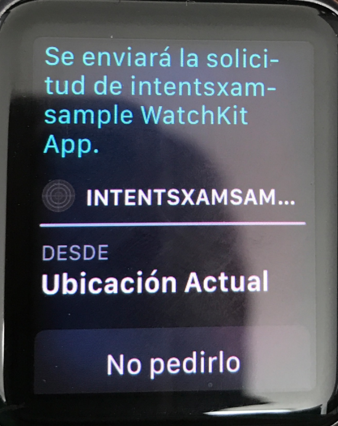

# XamarinSiriWatchExtension

This repository contains two Xamarin solutions, **intentsxamsample** and **blankwatchsiri**, both solutions contain a [SiriKit](https://developer.xamarin.com/guides/ios/platform_features/introduction-to-ios10/sirikit/) watchOS extension.

## blankwatchsiri

This is a template that you can use in your own solution, it contains the following projects:

*  blankwatchsiri: This is the main iOS App that serves as the container of the watchOS App.
*  blankwatchsiri.WatchApp: This is the main watchOS App that serves as the container of the watchOS App Extension.
*  blankwatchsiri.WatchAppExtension: This is where you code your watchOS App and **it is also the container of the SiriKit watchOS Extension**
*  **WatchSiriExtension**: This is the SiriKit watchOS extension project you want to include into your own Xamarin solution (as of today 2016/26/02 you need to do this manually).

So once you included **WatchSiriExtension** project into your solution, you will need to manually edit your **watchOS App Extension** project ([.csproj](blankwatchsiri/blankwatchsiri.WatchAppExtension/blankwatchsiri.WatchAppExtension.csproj) file) with your favorite editor and add the following:

Add this `ItemGroup` right **before** the `<Import>` tag, note you will need to modify the `<Project>` GUID to **match yours**, you can find this in your soultion ([.sln](blankwatchsiri/blankwatchsiri.sln)) file once you added the **WatchSiriExtension** into your solution:

```xml
<ItemGroup>
  <ProjectReference Include="..\WatchSiriExtension\WatchSiriExtension.csproj">
    <IsAppExtension>true</IsAppExtension>
    <Project>{492A4AC2-BFEA-4C60-8B07-30FAE79F5083}</Project>
    <Name>WatchSiriExtension</Name>
  </ProjectReference>
</ItemGroup>
```

Now you need to add this `<Target>` right **after** the `<Import>` tag:

```xml
<Target Name="BeforeCodesign">
  <ItemGroup>
    <WAppexFolder Include="..\WatchSiriExtension\bin\$(Platform)\$(Configuration)\WatchSiriExtension.appex\**\*.*" />
  </ItemGroup>
  <RemoveDir Condition="Exists('$(AppBundleDir)\PlugIns')" Directories="$(AppBundleDir)\PlugIns" />
  <Copy SourceFiles="@(WAppexFolder)" DestinationFolder="$(AppBundleDir)\PlugIns\WatchSiriExtension.appex\%(RecursiveDir)" />
</Target>
```

This will manually copy the SiriKit watchOS extension appex into the `PlugIns` folder inside your watchOS App Extension appex right before codesigning it. You might want to tweak both code snippets a little in case you have a different path or you named **WatchSiriExtension** project something else.

If you followed the above steps you should be all set, happy coding.

## intentsxamsample

This is a working example of a SiriKit watchOS/iOS extension, it tries to get you a taxi if you ask Siri to get you one and also shows in maps iOS app as a ride option. Remember that in order to test this you will need to do it on a physical device.

### Usage

1. Follow [our intructions](https://developer.xamarin.com/guides/ios/platform_features/introduction-to-ios10/sirikit/implementing-sirikit/#Setting_the_Required_Entitlements) to correctly set up entitlements and provisioning profiles, for this example you will need `com.alexsoto.intentsxamsample` as your main app bundle ID.
2. Build & run the app on your device. Confirm when prompted w/ the Siri permissions dialog.
3. Once you have authorized the app to use Siri, Ask Siri "Request a ride" from your watch you should see something like this

